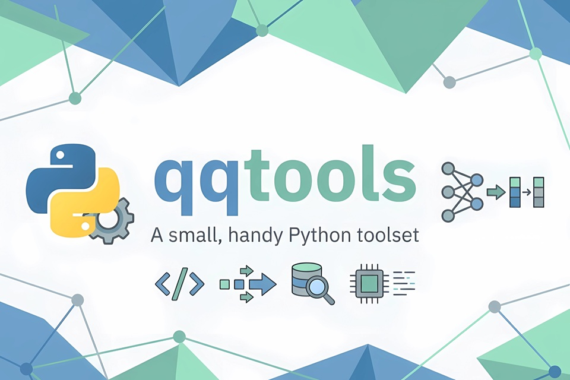

<div style="
  position: relative;
  width: 100%;
  padding-top: 66.66%; 
  margin-bottom: 20px;
  background: #f0f0f0 url('static/banner_960.jpg') center/contain no-repeat;
  background-size: cover;
">
  
</div>

# ✨qqtools✨
[](https://pepy.tech/projects/qqtools)  

A lightweight library, crafted and battle-tested daily by *qq*, to make PyTorch life a little easier.

I’ve gathered the repetitive parts of my day-to-day work and refined them into this slim utility library.
It serves as my personal toolkit for handling data, training, and experiments, designed to keep projects moving fast with cleaner code and smoother workflows (and hopefully yours too!).

>Built for me, shared for you.

## What it includes

At its core, `qqtools` is a collection of small utilities I use around PyTorch projects:

- data containers such as `qDict` and `qData`
- dataset and dataloader helpers such as `qDictDataset` and `qDictDataloader`
- small neural network helpers such as `qMLP`
- a lightweight training framework, `qpipeline`
- a command-line experiment queue for Linux, `qexp`
- config and serialization helpers for YAML, JSON, pickle, and LMDB

At the core, it is still a practical toolbox for the repetitive parts around experiments.


## Install


```bash
# Core install
pip install qqtools

# Full install
pip install qqtools[full]

# If you only want the experiment queue extras:
pip install qqtools[exp]
```

> While some parts still work with `torch==1.x`, `torch>=2.4` is recommended


## qDict

`qDict` is mainly there for cleaner attribute access in batch-like code:

```python
# Instead of dirty dict brackets:
# batch["input_ids"], batch["attention_mask"]

# Use clean attribute access:
batch = qt.qDict({"input_ids": input_ids, "attention_mask": attention_mask})
out = model(batch.input_ids)
```

## qexp

`qexp` is a lightweight experiment queue for Linux hosts.
It is built around a shared project root, can work on multi-machines with multi-GPUs.

Quick start:

```bash
qexp init --shared-root /mnt/share/myproject/.qexp --machine gpu-a
qexp submit --name demo1 -- python train.py -c config1.yaml
qexp submit --name demo2 -- python train.py -c config2.yaml
qexp submit --name demo3 -- python train.py -c config3.yaml
# 3 tasks will be queued and run sequentially
```

After `init`, `qexp` saves the current `shared_root` and `machine` as CLI context, so you usually do not need to repeat them on every command.

Python API:

```python
from qqtools.plugins import qexp

task = qexp.submit(
    qexp.load_root_config("/mnt/share/myproject/.qexp", "gpu-a"),
    command=["python", "train.py", "--epochs", "10"],
    name="demo",
)
print(task.task_id)
```

>Note: Run `pip install qqtools[exp]` before use `qexp` command.

## qpipeline

`qpipeline` is a minimal training loop scaffold. It doesn't try to be a heavy framework. You write the project-specific model and task logic, and qpipeline handles the repetitive boilerplate: config-driven startup, train/val loops, metric aggregation, and checkpointing.

A tight training entry:

```python
import torch
from qqtools.plugins.qpipeline import prepare_cmd_args, qPipeline
from qqtools.nn import qMLP

class MyTask:
    def __init__(self, args):
        # Your custom data logic goes here
        self.train_loader, self.val_loader = build_loaders(args)

    def batch_forward(self, model, batch):
        return {"pred": model(batch.x)}

    def batch_loss(self, out, batch):
        loss = torch.nn.functional.mse_loss(out["pred"], batch.y)
        return {"loss": (loss, len(batch.y))}

    def batch_metric(self, out, batch):
        mae = (out["pred"] - batch.y).abs().mean()
        return {"mae": (mae, len(batch.y))}

    def post_metric_to_err(self, result):
        return result["mae"]

class MyPipeline(qPipeline):
    @staticmethod
    def prepare_model(args):
        return qMLP([16, 8, 1])

    @staticmethod
    def prepare_task(args):
        return MyTask(args)

if __name__ == "__main__":
    args = prepare_cmd_args()
    pipe = MyPipeline(args, train=True)
    pipe.fit()
```

Because qpipeline enforces a stable entry contract, it pairs perfectly with qexp for queued execution:

```bash
qexp submit -- python entry.py --config configs/train.yaml
```

Configuration follows a standard YAML structure. See [qConfig.md](docs/qConfig_en.md) for details.

## Plugin modules

Under `src/qqtools/plugins/`, there are also:

- `qchem` - tools for reading and processing quantum chemistry outputs
- `qpipeline` - a training pipeline framework built on top of the core torch utilities
- `qhyperconnect` - an implementation of Hyper-Connection for PyTorch

## Test

```bash
tox
```
