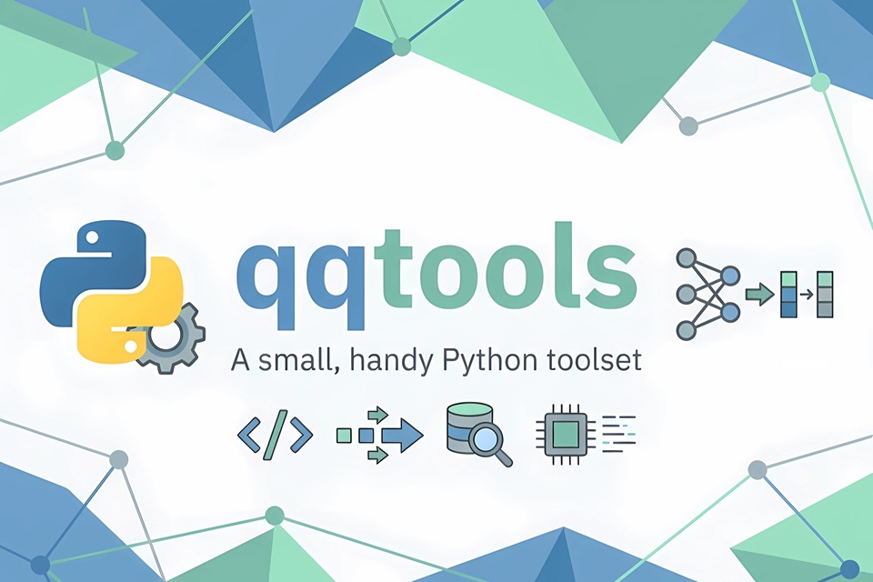

<div style="
  position: relative;
  width: 100%;
  padding-top: 66.66%; 
  margin-bottom: 20px;
  background: #f0f0f0 url('static/banner_960.jpg') center/contain no-repeat;
  background-size: cover;
">
  
</div>

# ✨qqtools✨
[](https://pepy.tech/projects/qqtools)  

A lightweight library, crafted and battle-tested daily by *qq*, to make PyTorch life a little easier.

It started from the frustration of PyG’s tightly coupled CUDA ecosystem—carefully matching CUDA versions, installing wheel builds from the official index, and repeatedly reinstalling dependencies like `torch-scatter` whenever anything changed. This project brings back a clean, one-line `pip install ...` experience, with no need to worry about CUDA compatibility.

I’ve gathered the repetitive parts of my day-to-day work and refined them into this slim utility library.
It serves as a unified toolkit for handling data, training, and experiments, designed to keep projects moving fast with cleaner code and smoother workflows.

>Built for me, shared for you.

## What it includes

At its core, `qqtools` is a collection of small utilities I use around PyTorch projects:

- data containers such as `qDict` and `qData`
- dataset and dataloader helpers such as `qDictDataset` and `qDictDataloader`
- small neural network helpers such as `qMLP`
- a lightweight training framework, `qpipeline`
- a command-line experiment queue for Linux, `qexp`
- config and serialization helpers for YAML, JSON, pickle, and LMDB

At the core, it is still a practical toolbox for the repetitive parts around experiments.


## Install


```bash
# Core install
pip install qqtools

# Full install
pip install qqtools[full]

# If you only want the experiment queue extras:
pip install qqtools[exp]
```

> While some parts still work with `torch==1.x`, `torch>=2.4` is recommended


## qDict

`qDict` is mainly there for cleaner attribute access in batch-like code:

```python
# Instead of dirty dict brackets:
# batch["input_ids"], batch["attention_mask"]

# Use clean attribute access:
batch = qt.qDict({"input_ids": input_ids, "attention_mask": attention_mask})
out = model(batch.input_ids)
```

## Context scope and `qt.use_ctx`

`qt.ctx` provides a lightweight scoped context. Values set inside `with qt.ctx(...)` are visible only in that scope and its nested calls, and the outer state is restored automatically when the block exits.

Scope exit restores the previous key bindings. If you intentionally mutate a shared mutable object in place through the live context, that mutation is considered caller-managed behavior and may remain visible outside the block.

```python
import qqtools as qt

with qt.ctx(dim=512):
    print(qt.ctx.dim)  # 512

print(qt.ctx.get("dim"))  # None
```

`@qt.use_ctx` is the simplest way to inject context values into a class constructor:

```python
import qqtools as qt


@qt.use_ctx
class AttentionLayer:
    def __init__(self, dim=64, heads=8):
        self.dim = dim
        self.heads = heads


with qt.ctx(dim=512, heads=16):
    layer = AttentionLayer()
    print(layer.dim, layer.heads)  # 512 16
```

Manual constructor arguments still take precedence over injected context values.

## qexp

`qexp` is a lightweight experiment queue for Linux hosts.
It is built around a shared project root, can work on multi-machines with multi-GPUs.

Quick start:

```bash
qexp init --machine gpu-a
qexp project init /mnt/share/myproject
qexp project register /mnt/share/myproject
qexp use --project /mnt/share/myproject/.qexp
qexp submit --name demo1 -- python train.py -c config1.yaml
qexp submit --name demo2 -- python train.py -c config2.yaml
qexp submit --name demo3 -- python train.py -c config3.yaml
# 3 tasks will be queued and run sequentially
```

`qexp init` creates the local machine identity and global agent configuration only. `project init`
creates shared Project truth, `project register` enrolls it in this machine, and `qexp use
--project <project/.qexp>` selects the default Project for ordinary commands. Selection neither
creates nor enrolls a Project.

Each qexp Machine has one global `qexp agent` process and one resource pool shared by all enrolled
Projects. A Project created by an older release with legacy agent metadata uses the one-time
`qexp admin migrate agent --project PATH --machine NAME`. `qexp agent start` starts or reuses the global agent and waits for every
enabled Project to become ready. `qexp agent run` is a foreground debugging stream: it has no
`--format` option or structured startup document. `Ctrl+C` stops that foreground agent, but does
not signal detached runners that it already launched.

```bash
qexp init --machine gpu-a --agent-mode daemon
qexp project register /mnt/share/myproject
qexp agent start
qexp agent status
qexp agent restart
qexp agent status  # observe readiness after process replacement
qexp agent stop
```

`agent restart` waits for replacement of the agent process, not for every Project to converge.
Its result can therefore say `Ready: pending`; use the following `agent status` to observe later
readiness. Status keeps configured `daemon|on_demand` policy distinct from a differing observed
mode.

The MachineRuntime also owns one persistent GPU allowlist shared by every registered project.
Change it while the agent is running; no restart is required:

```bash
qexp agent config gpus show
qexp agent config gpus set --visible 0,2,3
qexp agent config gpus set --none
qexp agent config gpus reset
```

`set --none` intentionally disables new GPU work, while CPU-lane work remains independent.
`reset` returns to the agent's inherited nonempty `QEXP_VISIBLE_GPUS` value or automatic discovery.
Removing a GPU drains existing qexp reservations there instead of terminating their Attempts.
Configured IDs missing from local discovery stay configured but are not admitted, and status/show
report an actionable warning. `unreserved` means only “not reserved by qexp”; qexp does not detect
external CUDA processes or physical GPU utilization.

Upgrade qexp and restart each machine's global agent before relying on this policy. Downgrading to
an older policy-unaware agent can expose GPUs again because the older agent ignores the policy file.

Use `qexp project list|enable|disable|remove` to manage local enrollment. The saved Project pool can
be reconciled after a deliberate fresh identity with `qexp project register --from-pool`. Older
per-project-agent metadata still uses the distinct `qexp admin migrate agent --project PATH --machine NAME` recovery workflow.

`qexp init` always creates a fresh runtime identity when one already exists, even when the name is
unchanged. It therefore requires confirmation or `--yes`; use `qexp agent name --set-to NAME` for a
name-only change. Copied images with unfinished evidence require the explicit
`--detach-old-runtime` decision; do not use it when the copy is the only recovery environment.

`--machine` is a project-local logical worker name and, for operational commands, a compatibility
assertion against the local MachineRuntime binding. It is not the Task target. Use
`--home-machine` to place a Task independently:

```bash
# Run on g3; only the registered g4 Project machine may claim this private Task.
qexp submit --home-machine g4 -- python train.py -c config1.yaml
```

Omitting `--home-machine` uses the verified local machine. A remote home must have a valid
current-generation Project machine record, but qexp does not remotely start its agent or transfer
files. `--no-activate` only suppresses local activation; it does not bypass identity or placement
validation.

### Schema 6 operation

qexp schema 6 uses the Group, Task, and Attempt runtime. Batch-era roots are not
compatible. A drained schema-5 root can be upgraded only when it has no active claim or
running Attempt:

```bash
qexp admin migrate schema --project /path/to/project/.qexp --machine gpu1 --to-schema 6
```

The agent owns lease renewal, Recovery, termination, terminal publication, and GPU
reservation release. The runner only starts the training process and writes local process
registration and exit-observation records. Inspect or change the shared lease policy only
while no active claim exists:

```bash
qexp config show lease
qexp config set lease --ttl-seconds 180 --renew-interval-seconds 10
qexp admin check --project /path/to/project
```

Schema 6 detects clock capability instead of requiring `chronyc` on every host. A qualified
provider permits full bounded-lease coordination; otherwise eligible work runs in holder-bound
local-safe mode and is never expired, remotely recovered, or automatically replaced.
`qexp admin check --project PATH` and `qexp agent status` expose the provider, authority mode, and blocker.

For existing-project upgrades, including recovery from `ready_index=degraded` / `marker corrupt`
and the explicit 1.3.15 schema-6 capability activation, see
[the qexp upgrade guide](docs/spec/qexp_upgrade_guide.md).

```bash
qexp task share TASK_ID
qexp task share TASK_ID --after 10m --with gpu-b,gpu-c
qexp task unshare TASK_ID
qexp task offer TASK_ID --format=json
```

`share` is the user-facing control for letting eligible Group workers help while the home
machine remains eligible. `share --after` records a bounded deadline; `unshare` clears the
shared policy and returns the Task to the home queue. `task offer` is retained for Tasks that
were already submitted with spillover policy and only moves that existing policy into the shared
queue. Scripts and other machine consumers must request structured output from finite commands
explicitly with `--format=json`; raw and continuous commands do not accept a structured format.

For normal task and cleanup workflows:

```bash
qexp submit --group sweep -- python train.py --config a.yaml
qexp submit --file runs.yaml --group sweep
qexp group pause sweep
qexp task retry TASK_ID
qexp task wait TASK_ID --timeout 30m
qexp task list --name demo1 --page-size 50
qexp task logs TASK_ID -n 100
qexp status
qexp admin clean --project /path/to/project --task-id TASK_ID --dry-run
qexp admin clean --project /path/to/project --older-than-days 30 --limit 100
```

Terminal notifications are disabled by default. After `qexp init --machine NAME` has initialized
the selected MachineRuntime, set up Feishu once without selecting a Project:

```bash
qexp notifications setup    # Hidden webhook prompt; enables the global default.
qexp notifications test     # Optional: send a labeled test from this CLI process.
```

For automation, supply a webhook through standard input. A direct `--webhook URL` argument also
works, but can be recorded in shell history and process arguments; use it only when that exposure
is acceptable. Missing input without an interactive terminal fails rather than hanging.

```bash
qexp notifications setup --webhook-stdin < /path/to/webhook-input
qexp notifications show
```

The default webhook is saved in an owner-private immutable credential under the selected
MachineRuntime (normally `~/.qqtools/qexp-machine`), not copied into each Project. Its location
may itself be backed by shared storage; the path is not proof of host isolation. New and existing
Projects without overrides inherit the global setting. To select a different Project robot, run
`qexp notifications setup --scope project` inside that Project (or pass `--project PATH`). To
disable just that Project, run `qexp notifications set --scope project --disabled`; to restore
inheritance, run `qexp notifications reset --scope project`. Convenience commands default to
global even when invoked inside a Project; `config show/set/reset notifications` defaults to
project and supports explicit `--scope global` for low-level configuration.

For optional Feishu signing, pass `--secret-env NAME` to setup and provide that variable to the
sending process. Replacing a signed destination requires choosing a new `--secret-env NAME` or
explicit `--unsigned`. `notifications show` redacts URLs and secret values. A test verifies the
invoking CLI's effective policy and environment only; it does not establish another agent's
environment readiness or verify every Project when testing the global default.

The webhook and secret are read by the process that commits the terminal transition. Non-sensitive
configuration and private-file credentials are read at dispatch time, so changing those files does
not require an agent restart. Environment variable value changes require restarting the agent
process; restarting the agent does not terminate the running task process. Delivery is synchronous
and no-throw with at-most-one send attempt: crashes
or network ambiguity can permanently lose a notification, and qexp does not retry it.

Before version 1.3.24, supported old binaries may still write legacy Project-machine records.
Version 1.3.22 imports them automatically when an agent restarts and reconciles later old writes;
a conflict after a canonical edit blocks delivery for that Project until explicitly resolved with
`qexp notifications resolve --scope project --prefer canonical|legacy`. The old shared webhook file
is retained while old readers are supported. New private credentials removed by reset or
replacement are retained until eligible for bounded maintenance cleanup (24 hours for never-used
staging orphans; seven days after a formerly active credential becomes unreferenced). A reset does
not delete secrets immediately. Check `qexp notifications show` for the selected runtime's state.

Feishu notifications are sent as interactive cards with status colour, Markdown field labels, and
terminal Task metadata. The card's `Notification Machine Time` field is the event's `finished_at` value from the
machine clock; qexp does not query an external time source or convert it to the recipient's timezone.

`submit --file` manifests may name a Group, set Group workers and nested placement defaults, with per-Task
overrides:

```yaml
group:
  name: sweep
  workers: [g1, g2]
defaults:
  tmux: false
  placement:
    home_machine: current
    sharing:
      mode: spillover
      fallback_machines: group
tasks:
  - command: [python, train.py]
    tmux: true
  - placement:
      sharing:
        mode: private
    command: [python, control.py]
```

Group membership is explicit: `group create` defaults to the current machine only when
`--workers` is omitted, while an explicit list is exact. Either submission mode can create a
missing named Group atomically. A new Group without a worker declaration starts with the verified
submitting machine; an explicit manifest declaration is exact. `--group` overrides `group.name`.

During a shared-filesystem outage, the owning agent retains the training process and GPU
reservation in `suspect` and then `isolated` state; it does not create a replacement Attempt
or impose an automatic kill deadline. When shared authority becomes available again, the agent
renews the same claim, recovers the same orphaned Attempt with a new token, or terminates the
old process through its durable termination-decision path if authority changed.

Cleanup waits for required machines to acknowledge removal of matching local GPU reservations,
process manifests, and logs before deleting shared Task and Attempt records. Required machines
are the Task home machine, historical Attempt machines, and the machine that prepared cleanup.
Pending operations report `waiting_ack` and the remaining machine names. Cleanup blocks retry,
claim, cancel, and offer, and its tombstone permanently reserves the Task ID.

Operation summaries use `accepted` or `waiting_ack` while durable convergence remains, `blocked`
when operator action is required, and `completed` only after the command's convergence boundary.
Pending results include an operation reference and exact follow-up command when one exists.

File mode is only a bulk-input mode and does not create a public Batch identity. Explicit
`submit --tmux|--no-tmux` overrides every Task, followed by Task and `defaults.tmux` values; null
or omission inherits the next level. The normalized override is retained across retries without
becoming a Group-wide default. Use `submit --dry-run` for a read-only normalized preview and
`submit --quiet` for committed Task IDs only.

Python API:

```python
from qqtools.plugins import qexp

task = qexp.submit(
    qexp.load_root_config("/mnt/share/myproject/.qexp", "gpu-a"),
    command=["python", "train.py", "--epochs", "10"],
    name="demo",
)
print(task.task_id)
```

>Note: Run `pip install qqtools[exp]` before use `qexp` command.

## qpipeline

`qpipeline` is a minimal training loop scaffold. It doesn't try to be a heavy framework. You write the project-specific model and task logic, and qpipeline handles the repetitive boilerplate: config-driven startup, train/val loops, metric aggregation, and checkpointing.

A tight training entry:

```python
import torch
from qqtools.plugins.qpipeline import prepare_cmd_args, qPipeline
from qqtools.nn import qMLP

class MyTask:
    def __init__(self, args):
        # Your custom data logic goes here
        self.train_loader, self.val_loader = build_loaders(args)

    def batch_forward(self, model, batch):
        return {"pred": model(batch.x)}

    def batch_loss(self, out, batch):
        loss = torch.nn.functional.mse_loss(out["pred"], batch.y)
        return {"loss": (loss, len(batch.y))}

    def batch_metric(self, out, batch):
        mae = (out["pred"] - batch.y).abs().mean()
        return {"mae": (mae, len(batch.y))}

    def post_metric_to_err(self, result):
        return result["mae"]

class MyPipeline(qPipeline):
    @staticmethod
    def prepare_model(args):
        return qMLP([16, 8, 1])

    @staticmethod
    def prepare_task(args):
        return MyTask(args)

if __name__ == "__main__":
    args = prepare_cmd_args()
    pipe = MyPipeline(args, train=True)
    pipe.fit()
```

Because qpipeline enforces a stable entry contract, it pairs perfectly with qexp for queued execution:

```bash
qexp submit -- python entry.py --config configs/train.yaml
```

When qexp launches a standard qpipeline training script, live progress is connected
automatically. The script does not need a callback, reporter, progress path, or qpipeline
configuration change. Inspect the existing Task while it runs:

```bash
qexp task show TASK_ID
qexp task show TASK_ID --watch
qexp task logs TASK_ID --follow
```

```text
Progress status: available
Stage: validation
Progress: 20/100 batch (20.0%)
Message: Dataset B · EMA · Epoch 4/10
Progress reported: 2026-09-18 16:00:25 UTC (35s ago)
```

Progress reporting defaults to one update every 30 seconds. A project with many concurrent
Tasks can trade freshness for lower local and shared filesystem write pressure:

```bash
qexp config show progress
qexp config set progress --interval-seconds 60
qexp config show tmux
qexp config set tmux --enabled
```

The setting applies to subsequent launches and retries; already-running Attempts keep the
interval resolved when they launched. The interval controls write frequency, not a visibility
deadline: producer, agent, scan, and filesystem delays can make an update visible later. Generic
Python applications can use `qqtools.qexp.progress.update()` directly, while custom producers may
atomically replace the injected `QEXP_PROGRESS_PATH` progress-v1 mailbox and honor
`QEXP_PROGRESS_INTERVAL_SECONDS`. Progress remains advisory and never controls Task execution.

qexp-created tmux windows are optional, read-only Attempt-log observers and are disabled by
default. Enable the project fallback for future decisions with `qexp config set tmux --enabled`,
or select one submission with `qexp submit --tmux -- python entry.py`. `--no-tmux` is an explicit
Task override. Policy changes do not create or remove windows retroactively, and every owning
machine must run a supporting agent before project-wide enforcement is complete. Missing tmux or
libtmux remains an observation-only diagnostic; training continues through the detached runner.

`show --watch` refreshes a compact terminal-only view every two seconds and rejects `--format`.
Finite `task logs` and `logs --follow` preserve raw application bytes on stdout; qexp diagnostics
and stream boundaries use stderr, and structured formats are rejected. Both viewers stop after
the Task's validated terminal result by default; add `--follow-retries` only when the viewer
should remain open for a later retry. The refresh interval changes viewer reads, not the
application's progress reporting policy. Closing either viewer, or a qexp-created tmux log
window, never stops training. Buffered application output can still appear late, and finite
`qexp task logs TASK_ID` remains available for a later complete read.

For one-off runtime config edits, `qpipeline` also supports dotted CLI overrides after normal
parser handling:

```bash
python entry.py \
  --config configs/train.yaml \
  --task.dataloader.eval_batch_size 32 \
  --task.val_split val_ood \
  --runner.fast_dev_run
```

Configuration follows a standard YAML structure. See [qConfig.md](docs/qConfig_en.md) for details.

## Plugin modules

Under `src/qqtools/plugins/`, there are also:

- `qchem` - tools for reading and processing quantum chemistry outputs
- `qpipeline` - a training pipeline framework built on top of the core torch utilities
- `qhyperconnect` - an implementation of Hyper-Connection for PyTorch

## Development

Install [uv](https://docs.astral.sh/uv/getting-started/installation/); the repository
manages Python and test tools. No environment activation is needed.

```bash
# Daily tests (optional pytest arguments follow the command)
./scripts/dev test
./scripts/dev test tests/unit/qexp -q

# Complete integration gate (requires Linux and system tmux)
./scripts/dev preflight

# Optional: prepare .venv for your IDE; rerun when dependencies change
./scripts/dev env
```

Public engineering guides cover [development and promotion](docs/development/development-workflow.md),
[code style](docs/development/code-style.md),
[documentation](docs/development/documentation-guide.md),
[test governance](docs/development/test-governance.md),
[repository governance](docs/development/repository-governance.md), and
[compatibility governance](docs/development/compatibility-governance.md).

See [developer tooling maintenance](docs/development/developer-tooling.md) for platform
support, environment setup, and CI details.
