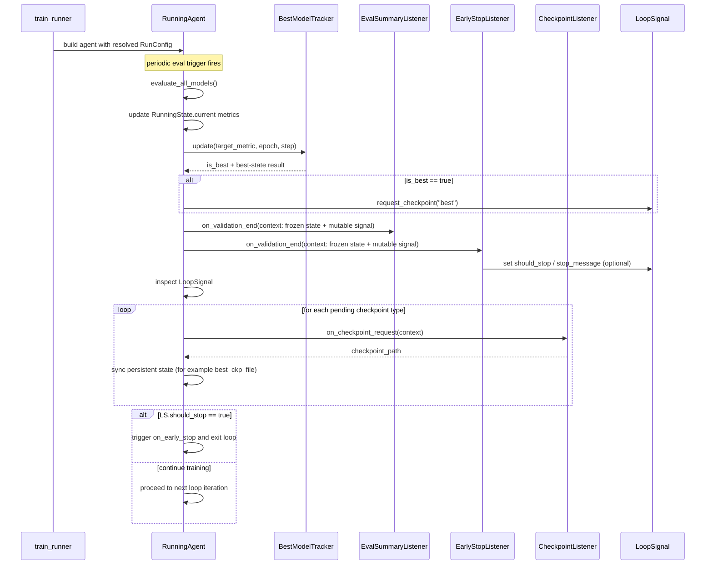

# Runner PRD (QPipeline Plugin)

## 1. Purpose and Scope

### 1.1 Purpose

This document defines product-level design rules for `train_runner` and `RunningAgent` in QPipeline.
It focuses on ownership boundaries, configuration policy resolution, and runtime state-machine behavior.

### 1.2 In Scope

- Field coupling and mutual-exclusion policy
- Effective value resolution order
- Runner state-machine design
- Event/listener data-flow contract

### 1.3 Out of Scope

- Low-level math/model details
- Task-specific metric definitions
- UI/logging style conventions beyond runner contracts

## 2. Ownership Model

### 2.1 Policy Owner: `train_runner`

`train_runner` owns business policy decisions, including:

- boundary mutual exclusion
- interval interpretation by mode
- fallback/default completion
- conflict handling and warnings

### 2.2 Execution Owner: `RunningAgent`

`RunningAgent` is policy-agnostic and executes already-resolved runtime values from `RunConfig`.
It should not re-interpret high-level policy conflicts.

### 2.3 Ownership Rule

Any rule equivalent to "field A suppresses field B" must be resolved in `train_runner` before creating `RunningAgent`.

## 3. Configuration Policy and Resolution

### 3.1 Primary Mode Switch

`run_mode` is the root switch for boundary and interval interpretation.
Supported values:

- `epoch`
- `step`

### 3.2 Boundary Mutual Exclusion

Resolved in `train_runner`:

- if `run_mode='epoch'`: keep `max_epochs`, ignore `max_steps`
- if `run_mode='step'`: keep `max_steps`, ignore `max_epochs`

### 3.3 Interval Coupling

`eval_interval` and `save_interval` are mode-coupled:

- `epoch` mode: units are epochs
- `step` mode: units are global steps

### 3.4 Metric Coupling

- `early_stop` is evaluated only at evaluation points, so effective cadence is coupled to `run_mode + eval_interval`.
- `checkpoint.target/mode/min_delta` controls best-model judgment and best-checkpoint semantics.

### 3.5 Effective Resolution Order

1. Read explicit function arguments and `args.runner` fields.
2. Validate required inputs (`run_mode`, `args.runner`, required boundary per mode).
3. Apply business policy (including boundary mutual exclusion).
4. Apply fallback/default values.
5. Build final `RunConfig`.
6. Instantiate `RunningAgent` with resolved config.

### 3.6 Conflict Handling

#### 3.6.1 Both Boundaries Provided

If both `max_epochs` and `max_steps` are provided, keep only the mode-compatible boundary and emit a warning.

#### 3.6.2 No Effective Boundary

At least one effective boundary must remain after resolution; otherwise raise an error.

## 4. Runtime State-Machine Design

This section consolidates the state-machine and listener refactor (2026-03-05).

### 4.1 Built-in vs External Capabilities

`BestModelTracker` is an intrinsic capability of `RunningAgent`.
It acts as a mutator/reducer in the core loop and owns best-state transition timing.

Reasoning:

- best-state mutation has strict ordering requirements
- downstream side effects (for example checkpoint save) depend on already-computed best-state results

`CheckpointManager` and `EarlyStopper` are externalized as listener-driven side-effect consumers.

### 4.2 Two-State Channels

The runtime state machine is split into:

- `RunningState`: durable agent-owned training state
- `LoopSignal`: mutable control intent for one loop cycle

### 4.3 Listener Data Contract

During event dispatch:

- `EventContext.state` is frozen (read-only snapshot)
- `EventContext.signal` is mutable

Listeners may read state and write loop intent through `LoopSignal`, but must not mutate agent-owned state directly.

### 4.4 Validation-End Flow

1. Runner executes evaluation (`evaluate_all_models`).
2. Runner updates current metrics in `RunningState`.
3. Runner applies built-in `BestModelTracker` mutation.
4. Runner constructs `EventContext` (`is_best`, `previous_best`, `eval_results`, frozen state, mutable signal).
5. Runner dispatches `on_validation_end` listeners.
6. Runner consumes `LoopSignal` and executes loop-control actions (early stop, checkpoint requests).

### 4.5 Checkpoint Sync Rule

Checkpoint persistence is a listener side effect (`checkpoint_path` output).
After callback completion, `RunningAgent` synchronizes persistent state fields (for example `best_ckp_file`) from callback results.

### 4.6 Listener Responsibilities

- `EarlyStopListener`: consumes metrics and writes stop intent into `LoopSignal`
- `CheckpointListener`: handles save side effect for checkpoint requests
- `EvalSummaryListener`: logs eval summary/table on validation end

## 5. Behavioral Examples

### 5.1 Boundary Examples

- Example A: `run_mode='epoch'`, `max_epochs=10`, `max_steps=1000` -> effective boundary: `max_epochs=10`, `max_steps=None`
- Example B: `run_mode='step'`, `max_epochs=10`, `max_steps=1000` -> effective boundary: `max_epochs=None`, `max_steps=1000`

### 5.2 Interval Example

- Example C: `run_mode='epoch'`, `eval_interval=2`, `save_interval=3` -> evaluate every 2 epochs, save regular checkpoint every 3 epochs

## 6. Non-Goals

- moving business mutual-exclusion policy into `RunningAgent`
- allowing listener-side direct mutation of runner-owned state
- letting logging semantics diverge from effective runtime behavior

## 7. Sequence Diagram (Validation Cycle)



## 8. Trigger Timing Diagram (Step vs Epoch Mode)

```mermaid
sequenceDiagram
    participant RA as RunningAgent
    participant EV as Eval Trigger
    participant SV as Save Trigger
    participant LOOP as Train Loop

    rect rgb(235,245,255)
    Note over RA,LOOP: Step mode (run_mode=step)
    LOOP->>RA: finish current batch (global_step = k)
    RA->>EV: check ((k+1) mod eval_interval == 0)
    alt eval trigger hit
        EV-->>RA: fire evaluation pipeline
    else no eval trigger
        EV-->>RA: skip
    end
    RA->>SV: check ((k+1) mod save_interval == 0)
    alt save trigger hit
        SV-->>RA: enqueue regular checkpoint
    else no save trigger
        SV-->>RA: skip
    end
    end

    rect rgb(245,255,235)
    Note over RA,LOOP: Epoch mode (run_mode=epoch)
    LOOP->>RA: finish last batch in epoch e (is_epoch_end = true)
    RA->>EV: check ((e+1) mod eval_interval == 0)
    alt eval trigger hit
        EV-->>RA: fire evaluation pipeline
    else no eval trigger
        EV-->>RA: skip
    end
    RA->>SV: check ((e+1) mod save_interval == 0)
    alt save trigger hit
        SV-->>RA: enqueue regular checkpoint
    else no save trigger
        SV-->>RA: skip
    end
    end
```

Notes:
- `save_interval` controls regular checkpoint triggers only.
- Best-checkpoint requests are driven by validation results (`is_best`), not by `save_interval`.

## 9. References

- ADR: `docs/adr/qpipeline/0001-runner-boundary-ownership.md`


